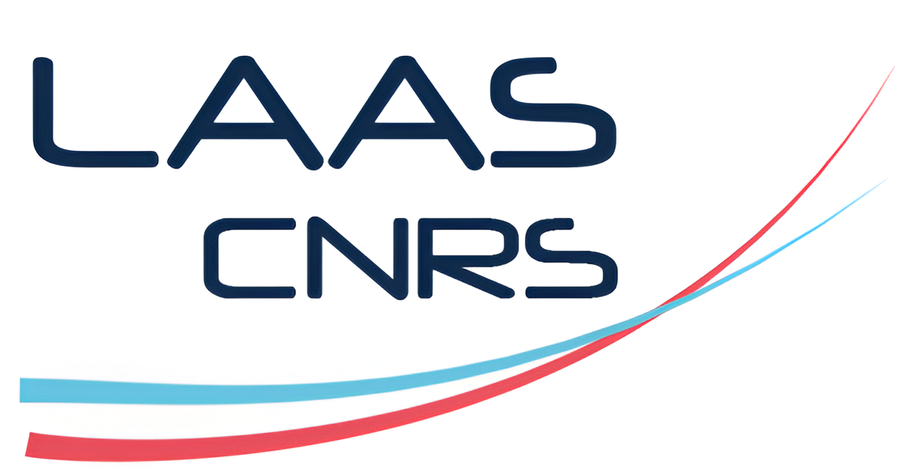

---
# You can also start simply with 'default'
theme: neversink
# random image from a curated Unsplash collection by Anthony
# like them? see https://unsplash.com/collections/94734566/slidev
background: https://cover.sli.dev
title: "Real-time constrained trajectory optimisation in robotics: theory, implementation, and applications"
info: |
  ## My PhD defence

  Presentation slides for developers.

addons:
  - tldraw

# apply unocss classes to the current slide
class: text-left
# https://sli.dev/features/drawing
drawings:
  persist: false
# enable MDC Syntax: https://sli.dev/features/mdc
mdc: true
# take snapshot for each slide in the overview
overviewSnapshots: true

# First slide
layout: cover
color: light
hideInToC: true
---

# Real-time constrained trajectory optimisation in robotics: theory, implementation, and applications

**PhD Defence**

Wilson Jallet 
*LAAS-Gepetto & INRIA Willow* 
<Email v="wjallet@laas.fr" />

<!-- 

  
    Press Space for next page <carbon:arrow-right class="inline"/>
  

 -->

  <button @click="$slidev.nav.openInEditor()" title="Open in Editor" class="text-xl slidev-icon-btn opacity-50 !border-none !hover:text-white">
    <carbon:edit />
  </button>
  </img>
  </img>

<!--
The last comment block of each slide will be treated as slide notes. It will be visible and editable in Presenter Mode along with the slide. [Read more in the docs](https://sli.dev/guide/syntax.html#notes)
-->

---
hideInToc: true
---

# Table of contents

<Toc columns=1 minDepth="1" maxDepth="2"></Toc>

---

## Robot control:  the problem

  

    The basic problem goes like this:
    </img>
  

  

  * Sensor data $y_t$: **noisy**
  * Control law: **known transformation** from sensor data
  * Robot: **somewhat known**
  * World: **imperfect, high variability**

  

---
layout: center
---

## Robot control: the "easy" case (industrial robots)

<figure class="w-1/2">
  
  <figcaption>

  KUKA Industrial Robot arms on a car assembly line. [Image source](https://commons.wikimedia.org/wiki/File:KUKA_Industrial_Robots_IR.jpg)
  </figcaption>
</figure>

* **Known environment, known robots**
* **Low variability**

---
layout: top-title
align: c
---

:: title ::

## Robot control: two ways

:: content ::

  

  ## Optimal control

  $$
  \begin{aligned}
    \min_{\bm{x}, \bm{u}}%
    &\sum_{t=0}^{N-1} \ell_t(x_t, u_t) + \ell_N(x_N) \\
    \mathrm{s.t.}~%
    &f_t(x_t, u_t, x_{t+1}) = 0 \\
    &g_t(x_t, u_t) \leq 0 \\
    &g_N(x_N) \leq 0.
  \end{aligned}
  $$

  

  

  ## Reinforcement learning

  $$
    \max_\theta J(\theta) = \mathbb{E}_{
        s_{t+1} \sim p(\cdot|x_t, u_t), u_t\sim \pi_\theta(\cdot|x_t)
    }\left[
        r_t(s_t, a_t) 
      \right]
  $$

  

---

## Why make tailored solvers?

- A solver like IPOPT has a lot of heuristics

---

## Augmented Lagrangians

---

### Introduction to ALM

---

## ProxDDP: an AL algorithm for constrained trajectory optimization

1. **WJ**, A. Bambade, N. Mansard, and J. Carpentier, ‘Constrained Differential Dynamic Programming: A primal-dual augmented Lagrangian approach’, in 2022 IEEE/RSJ International Conference on Intelligent Robots and Systems
2. **WJ**, N. Mansard, and J. Carpentier, ‘Implicit Differential Dynamic Programming’, in 2022 International Conference on Robotics and Automation (ICRA), Philadelphia, United States
3. **WJ**, A. Bambade, E. Arlaud, S. El-Kazdadi, N. Mansard, and J. Carpentier, ‘PROXDDP: Proximal Constrained Trajectory Optimization’, 2023. _Submitted to Transactions on Robotics (under revision)_

---
layout: top-title
---

:: title ::

## Benchmarks

:: content ::

- Compare against other nonlinear solvers ALTRO (tailored for OCP) and IPOPT (generic NLP solver)
  - Implemented wrappers around ALTRO and IPOPT to solve problems from `aligator`
- Set of three benchmark problems

Assess multiple configurations of the solvers:

- **ALTRO**/**IPOPT**: 2 configs each
- **ProxDDP:** test changing
  - AL penalty $\mu_0 > 0$...
  - linear vs. nonlinear rollout...
  - nonmonotone linesearch parameters...

---

### SOLO-12 "Yoga" task

A very nonlinear task for a whole-body model, 4 contact phases.

<video controls loop autoplay class="h-4/5">
  <source src="/solo12_lift_paw.mp4" type="video/mp4">
</video>

---

### SOLO-12 "Yoga": performance profile

---

### UR10 "ballistic" task: performance profile

  

---

### UR10 "Ballistic" task

- Underactuated system
- Hard constraint on projectile final's position

<video controls loop autoplay class="h-90">
  <source src="/ur10_mug_throw.mp4" type="video/mp4">
</video>

---
layout: two-cols-title
columns: is-4
---

:: title ::
### Deploying constrained MPC

:: left ::

#### Whole-body jumping on Unitree GO-2

- Constraints: joint torque limits, friction cones, landing ($z(t_\text{contact}) = 0$)
  - usually all thrown in cost function !
- Real-time on consumer-grade CPU, using the parallel Riccati recursion (~5ms per iteration)

:: right ::

<video controls loop autoplay class="w-full">
  <source src="/quadru_jump_edit.mp4" type="video/mp4">
</video>

---
layout: top-title
---

::title::

### Benchmarks: takeaway message

::content::

### Lack of a suite of standard benchmarks for robotics:

- nonlinear prog. has [CUTEr](https://en.wikipedia.org/wiki/CUTEr) 1 (Fortran) test set, Maros-Meszaros for QPs -- efforts at standardization 2
  - IPOPT was validated on ~954 problems from CUTEr
- In numerical OC, **everyone reimplements and tests their own problems, with their own solver's API.**
- Pinocchio = right modelling tool for rigid-body quantities
- Create a standard form for complex OCPs?
  - Symbolic language like AMPL? Julia's JuMP? CasADi? 

<footer>
  
[1] CUTEr: https://en.wikipedia.org/wiki/CUTEr

  
[2] qpenchmark by S. Caron: https://github.com/qpsolvers/qpbenchmark

</footer>

---

# Conclusion

